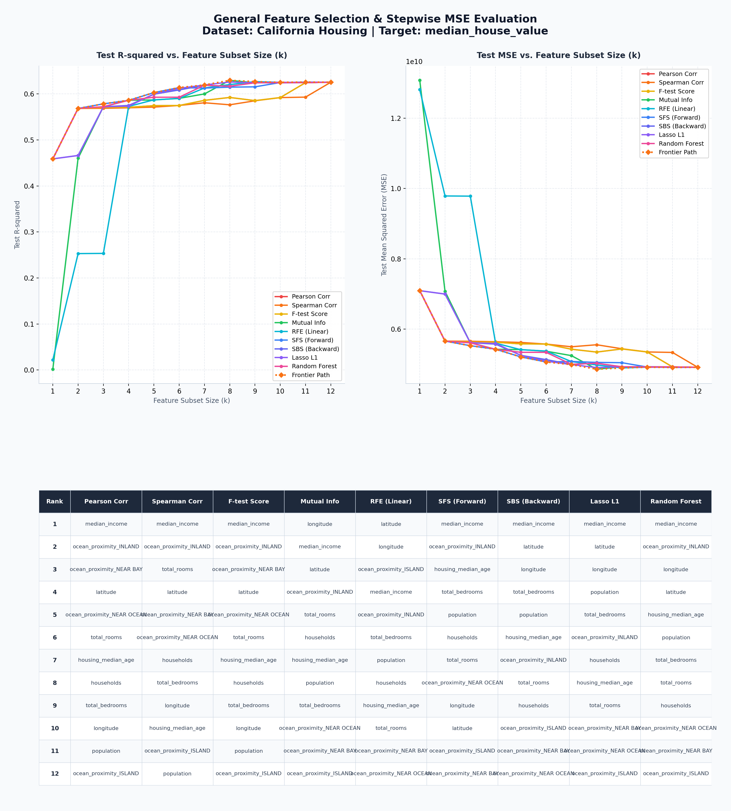
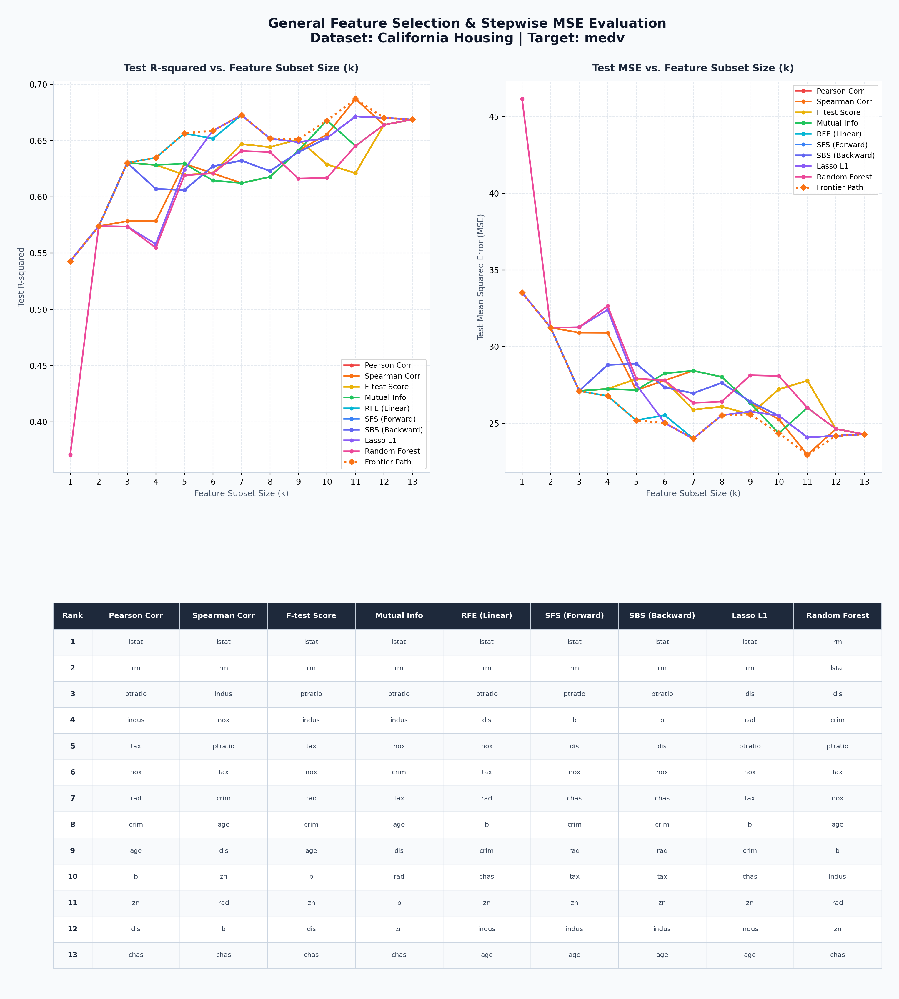

# Multiple Regression & Feature Selection Workflow

This repository implements an automated, general-purpose machine learning pipeline to perform feature selection and stepwise model evaluation on tabular regression datasets, as described in `workflow.md`.

Here, the workflow is applied to both the **California Housing** and **Boston Housing** datasets.

---

## 📈 Analysis Results

### 1. California Housing Dataset
- **Target Variable**: `median_house_value`
- **Result Plot**:
  

#### California Housing Key Insights:
* **Top Feature**: `median_income` was ranked **#1** across all 9 selection methods.
* **Subset Sweet Spot**: The elbow point in the Test MSE plot occurs at **$k = 4$ or $k = 5$ features**. Beyond 5 features, the model gains little predictive power (full performance is $R^2 \approx 0.614$, while $k=5$ features yields $R^2 \approx 0.610$).

---

### 2. Boston Housing Dataset
- **Target Variable**: `medv`
- **Result Plot**:
  

#### Boston Housing Key Insights:
* **Top Features**: `lstat` (percentage of lower status of the population) and `rm` (average number of rooms per dwelling) are consistently ranked in the top 2 across all selectors.
* **Subset Sweet Spot**: The elbow point occurs at **$k = 4$ or $k = 5$ features**. A subset of size $k = 5$ achieves a Test R-squared of approximately **`0.71`**, which is very close to the full 13-feature model's performance of **`0.725`**.

---

## 🛠️ Step-by-Step Instructions

### 1. Requirements
Ensure you have the required packages installed:
```bash
pip install pandas numpy scikit-learn matplotlib scipy
```

### 2. Run the Pipeline
To run the automated analysis:
1. Copy your target dataset in the root folder and name it `data.csv`.
2. Execute the runner script:
   ```bash
   python run_workflow.py
   ```
3. The script will automatically:
   - Detect target and feature types (handles numeric standardization and categorical one-hot encoding).
   - Compute rankings using 9 distinct feature selection methods.
   - Run stepwise linear regression for $k = 1$ to $N$ features.
   - Save the visualization as `feature_selection_performance_allinone.png`.
